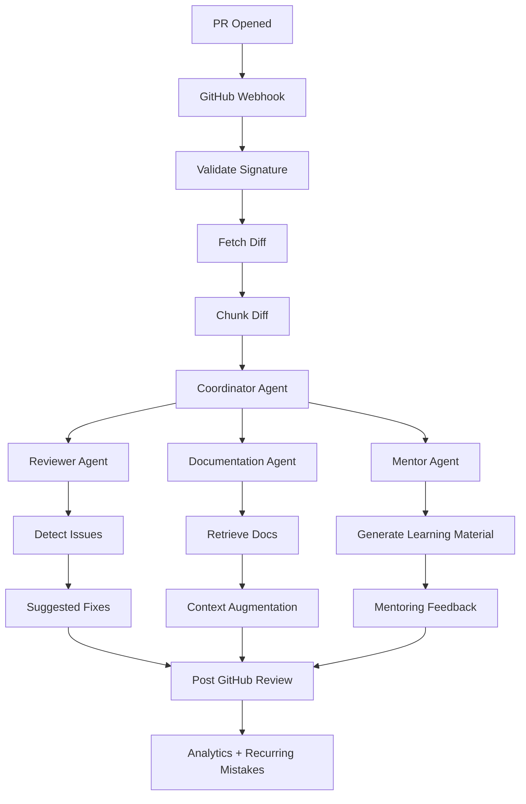
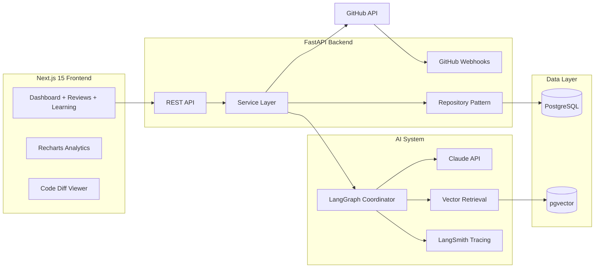
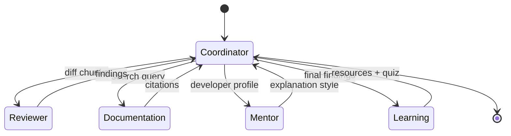
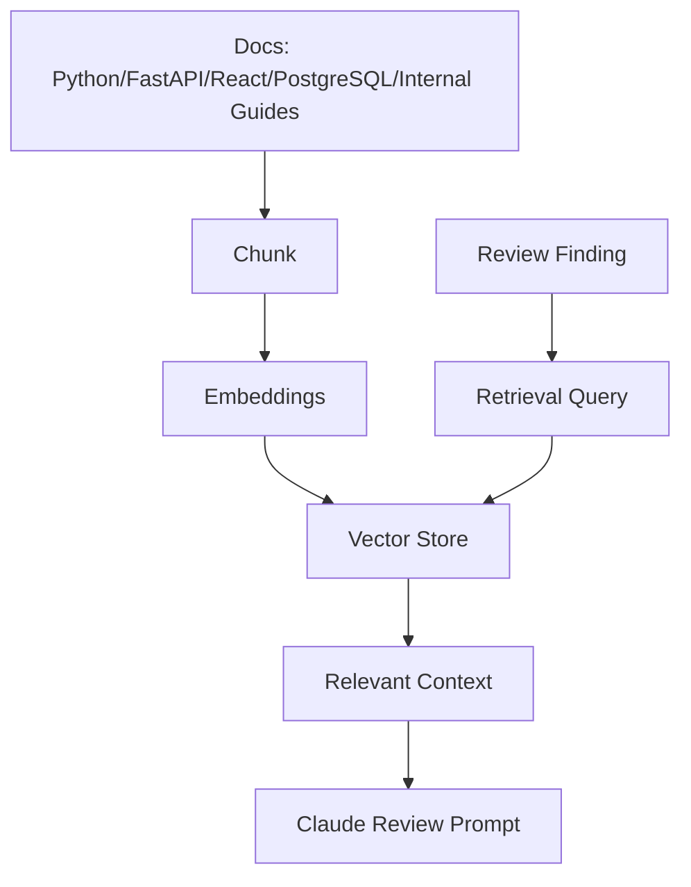

# ai-code-review-mentor

> AI pull request reviewer that combines automated code review, mentoring feedback, learning resources, and recurring mistake analytics.

## Product Vision

`ai-code-review-mentor` helps engineering teams review pull requests faster without losing the teaching moments that make reviews valuable. The system listens to GitHub pull request events, analyzes code changes with LangGraph agents, adapts explanations to the developer's experience level, retrieves trusted documentation, and posts actionable review feedback back to GitHub.

It is designed to feel like **GitHub Copilot Reviews + CodeRabbit + Linear**: fast, polished, traceable, and focused on developer growth.

## Core Capabilities

- GitHub OAuth login and repository connection.
- Pull request webhook ingestion and diff fetching.
- AI review generation using Claude, LangChain, and LangGraph.
- Beginner, intermediate, and senior feedback modes.
- Suggested fixes, documentation links, StackOverflow-style references, and mentoring notes.
- RAG over Python, FastAPI, React, PostgreSQL, and internal engineering guides.
- Pattern detection for recurring mistakes.
- Review history, analytics, team dashboard, and learning dashboard.
- Prompt playground for safely iterating review prompts.

## System Flow



### Stage-by-stage explanation

1. **PR Opened**: GitHub emits a pull request event when a PR is opened, synchronized, or reopened.
2. **Webhook Trigger**: FastAPI receives the event and stores a normalized webhook record.
3. **Fetch Diff**: The GitHub service fetches changed files and patch content through the GitHub API.
4. **Chunk Diff**: Large diffs are split into model-safe chunks so context windows are used predictably.
5. **Analyze Changes**: LangGraph coordinates specialist agents over each diff chunk.
6. **Detect Issues**: The reviewer agent identifies correctness, security, maintainability, and testing concerns.
7. **Generate Explanation**: The mentor agent rewrites findings in plain English for the developer's level.
8. **Generate Fix**: Suggested changes are generated as review comments or patch-style suggestions.
9. **Generate Learning Material**: The learning agent produces resources, quizzes, and interview prompts.
10. **Post Review**: GitHub review comments are posted and the review is persisted for analytics.

## Architecture



## Folder Structure

```text
ai-code-review-mentor/
├── backend/                  # FastAPI, LangGraph agents, repositories, services
├── frontend/                 # Next.js 15, TypeScript, Tailwind, shadcn-style UI
├── docs/                     # Teaching modules, architecture notes, learning roadmap
├── infra/                    # Deployment notes and infrastructure assets
├── .github/workflows/        # CI pipeline
├── docker-compose.yml        # Local PostgreSQL + backend + frontend orchestration
└── README.md                 # Premium project documentation
```

## AI Workflow

The AI workflow is intentionally split into specialized agents rather than one large prompt. This improves observability, testing, and future iteration.



## RAG System

The retrieval-augmented generation pipeline indexes trusted engineering documents into a vector store. During review, agent queries retrieve relevant snippets and append them as grounded context.



**Tradeoff:** RAG reduces hallucination and links feedback to trusted sources, but it adds ingestion complexity, freshness concerns, and retrieval quality tuning.

## Setup Guide

### Prerequisites

- Python 3.11+
- Node.js 20+
- Docker and Docker Compose
- PostgreSQL 16+ for non-Docker local development

### Environment

```bash
cp backend/.env.example backend/.env
cp frontend/.env.example frontend/.env.local
```

### Local development

```bash
docker compose up --build
```

Backend API: `http://localhost:8000`

Frontend: `http://localhost:3000`

API docs: `http://localhost:8000/docs`

## API Docs

| Method | Path | Purpose |
| --- | --- | --- |
| `GET` | `/health` | Health check |
| `POST` | `/webhooks/github` | Receive GitHub webhook events |
| `GET` | `/reviews` | List review history |
| `GET` | `/reviews/{review_id}` | Get review details |
| `GET` | `/analytics/summary` | Review and learning analytics |
| `POST` | `/playground/review` | Run a prompt playground review |

## Deployment Guide

### Backend: Railway

1. Create a Railway PostgreSQL database.
2. Deploy `backend/` using the included Dockerfile.
3. Add environment variables from `backend/.env.example`.
4. Configure GitHub webhook URL: `https://<railway-app>/webhooks/github`.

### Frontend: Vercel

1. Import the repository into Vercel.
2. Set the project root to `frontend`.
3. Add `NEXT_PUBLIC_API_URL` pointing to Railway.
4. Deploy.

## Screenshots

> Portfolio placeholders. Replace these with real screenshots after deployment.

- Dashboard overview: `docs/screenshots/dashboard.png`
- Review timeline: `docs/screenshots/review-timeline.png`
- Learning dashboard: `docs/screenshots/learning-dashboard.png`
- Prompt playground: `docs/screenshots/prompt-playground.png`

## Interview Talking Points

- Why agent orchestration is separated from API transport.
- How webhook signature validation protects the integration.
- How RAG grounds AI feedback in authoritative documentation.
- How review findings become analytics and recurring mistake detection.
- How experience-level feedback changes developer experience without changing correctness standards.
- How LangSmith traces make prompt and agent behavior debuggable in production.

## Learning Roadmap

1. Product vision and system design.
2. FastAPI clean architecture and dependency injection.
3. GitHub webhook security and API integration.
4. Diff chunking and review domain modeling.
5. LangGraph reviewer, mentor, documentation, learning, and coordinator agents.
6. RAG ingestion, embeddings, vector search, and context augmentation.
7. Next.js dashboard, review timeline, analytics charts, and learning UI.
8. Docker, CI, production deployment, and observability.

## Commit Plan

Suggested incremental commits for learning:

1. `docs: define product vision and system design`
2. `feat: scaffold FastAPI review domain`
3. `feat: add LangGraph review orchestration`
4. `feat: scaffold Next.js dashboard experience`
5. `chore: add Docker and CI workflow`
