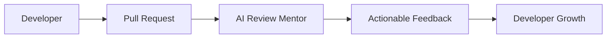
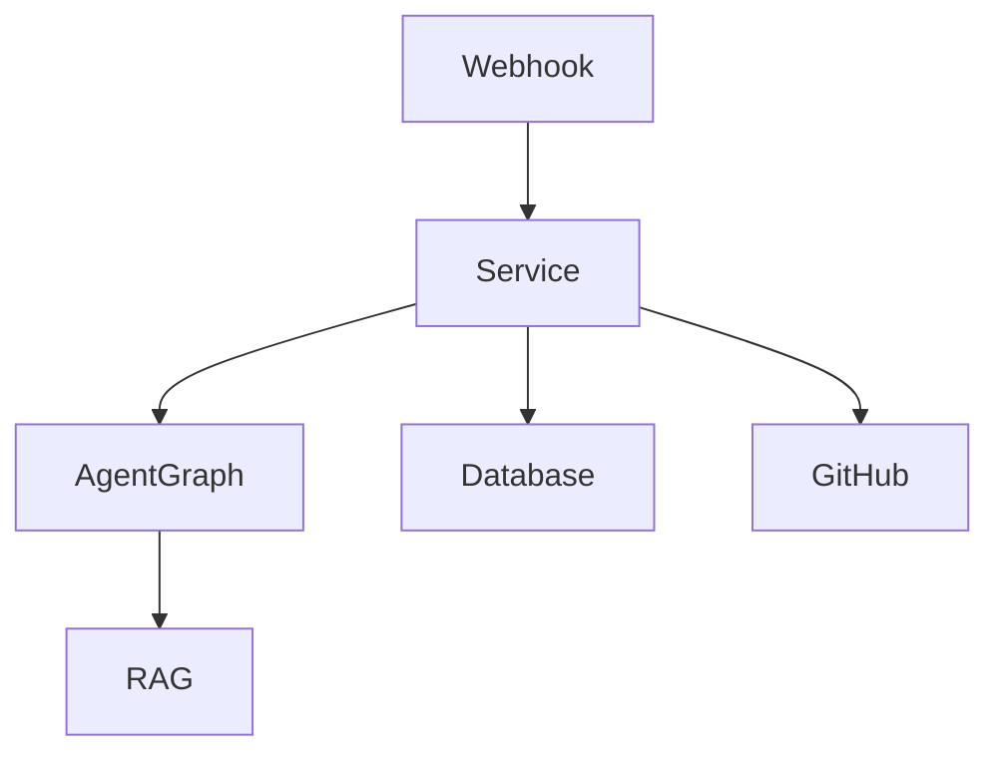

# Learning Roadmap

## Step 1: Product Vision

### Explanation
A strong AI engineering portfolio project starts with a real workflow, not a model call. This product targets pull request review because it combines event-driven systems, code understanding, human mentoring, and measurable outcomes.

### Diagram

### Code
Start by modeling the review lifecycle in backend domain objects before connecting external APIs.

### Quiz
1. Why should the product store review history instead of only posting GitHub comments?
2. What is the risk of giving junior and senior engineers identical explanations?

### Interview Questions
1. How would you prove this AI reviewer improves team productivity?
2. What failure modes would you monitor after launch?

## Step 2: System Design

### Explanation
The architecture separates API handling, GitHub integration, AI orchestration, persistence, and UI rendering. This keeps the system testable and makes it easier to swap model providers or vector stores later.

### Diagram

### Code
The backend uses services for business workflows and repositories for persistence boundaries.

### Quiz
1. Why should webhook validation happen before parsing business data?
2. What belongs in a service that should not belong in a repository?

### Interview Questions
1. Explain clean architecture in this project.
2. How would you make review generation idempotent?
