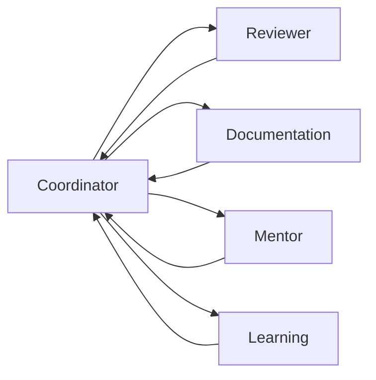

# Agent System Module

## Explanation
The agent system uses a coordinator graph to route work to specialist agents. A reviewer agent finds issues, a documentation agent retrieves evidence, a mentor agent adapts tone and depth, and a learning agent creates resources.

## Diagram

## Code
See `backend/app/agents/graph.py` for the production-oriented graph abstraction and typed state.

## Quiz
1. Why is typed state useful in LangGraph?
2. When would you add another specialist agent?

## Interview Questions
1. How do nodes and edges map to production workflow steps?
2. How would you test tool calling without invoking a real model?
