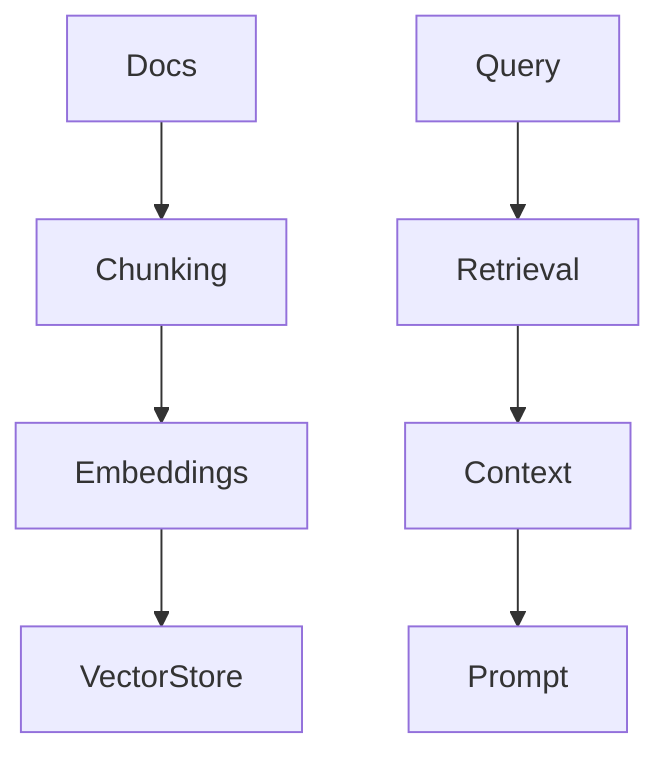

# RAG System Module

## Explanation
RAG gives the reviewer trusted context from documentation and internal guides. The system chunks source documents, embeds them, stores vectors, retrieves relevant passages, and augments prompts.

## Diagram

## Code
See `backend/app/rag/retriever.py` for a swappable retriever protocol and deterministic local implementation.

## Quiz
1. Why should internal engineering guides be included in retrieval?
2. What can go wrong if chunks are too large?

## Interview Questions
1. How would you evaluate retrieval quality?
2. How would you keep indexed documentation fresh?
